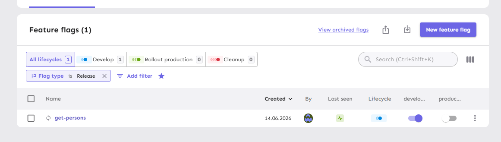
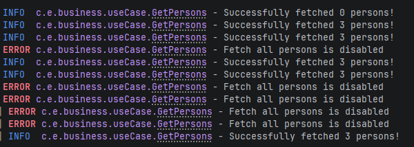

## Micronaut Template Doc
This is a base micronaut backend project implementation with the following features
- Jooq database class generation
- Openapi spec generator
- Logging
- Unleash feature flags for develop/local development

## Development notes and getting started

### Jooq generation
Jooq is configured to first generate the /structure/ changesets and then /data/ changesets. Both ``.sql`` and ``.yml`` are supported.

1. Initialise db containers

``
docker compose up -d
``

2. Apply changesets

``
./gradlew :database:update
``

3. Generate jooq

``
./gradlew generateJooq
``

4. Apply generated changesets (after every jooq generation)

``
./gradlew :database:update
``

### Openapi API's generation
Example made in
- ``openapi/src/main/resources/swagger/openapi.yml``
- ``src/main/java/com/example/business``

1. Generate openapi APIs

``
./gradlew :openapi:generateServerOpenApiApis
``

2. Generate openapi models/schemas

``
./gradlew :openapi:generateServerOpenApiModels
``

### Unleash
- Port: localhost:4242
- User: unleash
- Password: unleash

Example flag referenced in ``src/main/java/com/example/business/useCase/GetPersons.java``

